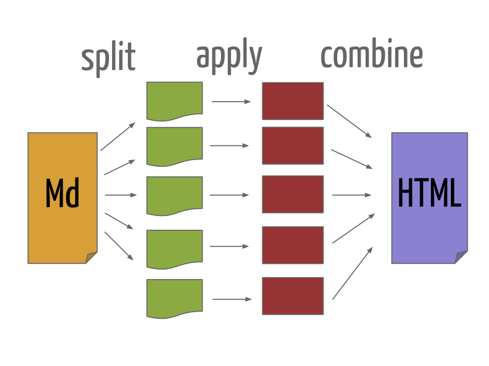

```{r setup, include=FALSE}
source("setup_knitr.R")
```

# Criando um documento dinâmico com Markdown e R

No exemplo anterior, escrevemos um documento em Markdown (`.md`) e
inserimos códigos do R, que são apenas apresentados no documento final.
Desse forma temos um documento **estático**, pois os códigos não são
interpretados. Para fazermos esse documento ser **dinâmico**, vamos usar
o pacote **knitr** a nosso favor, fazedo com que ele interprete e
retorne resultados dos códigos que inserimos. Vamos denominar
genericamente essa combinação de texto em Markdown e códigos do R de "R
Markdown".

Arquivos escritos em R Markdown não podem ser compilados usando
ferramentas padrão de conversão de Markdown. O código R deve ser
avaliado antes da conversão usando o Pandoc, por exemplo. R Markdown
pode ser convertido para Markdown através do knitr. Os resultados de
códigos do R são inseridos entre o texto em Markdown, que pode então ser
convertido para HTML usando o Pandoc.

O uso do R Markdown para criar documentos dinâmicos tem se tornado uma
ferramenta chave atualmente em *literate statistical programming*, e
substituiu largamente ferramentas anteriores como o Sweave.

Os detalhes e opções do pacote knitr serão descritas mais adiante. Por
enquanto, o que precisamos fazer para tornar esse documento dinâmico é
alterar a extensão do arquivo de `.md` para `.Rmd`, e alterar a forma
dos blocos de código. Os blocos de códigos (ou *chunks*) agora devem
conter uma marcação especial para indicar que devem ser interpretados
pelo R, através do knitr. Para isso, colocamos `{r}` no início de cada
bloco, que agora ficam

    ```{r}`r ''`
    x <- rnorm(30)
    ```

Usando o mesmo exemplo anterior, vamos renomear o arquivo `Exemplo1.md`
para `Exemplo1-knitr.Rmd` e incluir a marção `{r}` nos blocos de código.

Também é possível colocar códigos do R para serem renderizados na
própria linha de texto com `` `r '\x60r \x60'` ``. Por exemplo,
`` `r '\x60r 2+2\x60'` `` gera o resultado `r 2+2` no documento.

Veja o arquivo [Exemplo1-knitr.Rmd](exemplos/Exemplo1-knitr.Rmd).

```{r echo=FALSE}
cat(system("cat exemplos/Exemplo1-knitr.Rmd", intern = TRUE), sep = "\n")
```

Agora usamos o knitr, através da função `knit()` para compilar o
documento `.Rmd` em um documento com sintaxe Markdown `.md`

```{r eval=FALSE}
knit("exemplos/Exemplo1-knitr.Rmd", output = "exemplos/Exemplo1-knitr.md")
```

<table>
<tr>
<td align="center"></td>
</tr>
</table>

O resultado da compilação pode ser vista no arquivo
[Exemplo1-knitr.md](exemplos/Exemplo1-knitr.md).

```{r echo=FALSE}
cat(system("cat exemplos/Exemplo1-knitr.md", intern = TRUE), sep = "\n")
```

Agora temos um documento em Markdown com os códigos do R avaliados. Mas
ainda precisamos processar esse arquivo para gerar o arquivo `.html`
através do Pandoc

```{r eval=FALSE}
pandoc(input = "exemplos/Exemplo1-knitr.md", format = "html")
```

que gera o arquivo
[Exemplo1-knitr_utf8.html](exemplos/Exemplo1-knitr_utf8.html) que pode
ser visualizado no navegador.

# knitr

## Opções do knitr

Todas as opções do knitr para controlar a saída dos resultados de
códigos do R são válidas para o R Markdown.

* Para afetar um único *chunk*, coloque as opções individualmente
<pre><code>```{r, opt1=val1, opt2=val2}
# código
```</code></pre>
* Para afetar **todos** os *chunks* de um documento, use a função
`knitr::opts_chunk$set()`:
<pre><code>```{r, echo=FALSE}
knitr::opts_chunk$set(opt1 = val1,
                      opt2 = val2
)
```</code></pre>

As opções mais importantes são

* `eval = FALSE` para não avaliar o código, apenas mostrar
* `echo = FALSE` para não mostrar o código, apenas as saídas
* `results = "hide"` para não mostrar as saídas
* `results = "asis"` para que o resultado seja tratado como texto
  literal em Markdown. Por exemplo, para gerar uma tabela a partir de um
  objeto do R, podemos usar a função `knitr::kable()`
<pre><code>```{r, results="asis"}
kable(head(iris))
```</code></pre>

```{r, results="asis", echo=FALSE}
kable(head(iris))
```

* `warning = FALSE` e `message = FALSE` para suprimir as mensagens de
  aviso
* `fig.width = 5` and `fig.height = 5` para alterar o tamanho dos
  gráficos gerados pelo R (em polegadas)
* `cache = TRUE` para armazenar os resultados

A lista completa de opções está em <http://yihui.name/knitr/options>.

# R Markdown

## Metadados

Uma opção interessante ao utilizar o Pandoc é incluir metados no formato
[YAML][].

Os metadados em YAML são escritos em formato de lista aninhada, e o
Pandoc usa essas informações para incluir, por exemplo, título, autor, e
data em um documento.

A opção mais importante para o `rmarkdown` é o campo `output`, que
permite especificar o formato desejado de saída, o mesmo especificado no
argumento `output_format =` da função `render()`.

Os metadados em YAML são colocados sempre no **início** de um documento,
e são delimitados por `---`. Exemplo típico:

```
---
title: "Meu documento em R Markdown"
author: "Fernando Mayer"
date: 18 de setembro, 2015
output: html_document
---
```

Veja o arquivo [Exemplo1-yaml.Rmd](Exemplo1-yaml.Rmd).

Com isso, não é mais necessário especificar o argumento `output_format
=` na chamada da função `render()`.

Também é possível incluir vários formatos ao mesmo tempo, por exemplo

```
---
title: "Meu documento em R Markdown"
author: "Fernando Mayer"
date: 18 de setembro, 2015
output:
  html_document: default
  pdf_document: default
---
```

E compilar todos eles ao mesmo tempo com

```{r, eval=FALSE}
render("Exemplo1-yaml.Rmd", output_format = "all")
```

Veja [Exemplo1-yaml.html](Exemplo1-yaml.html), e
[Exemplo1-yaml.pdf](Exemplo1-yaml.pdf).

## Usando o R Markdown

Para facilitar a conversão de arquivos `.Rmd` em `.html`, usamos o
pacote [rmarkdown][], através da função `render()`.

A função `render()` é uma *wrapper* que internamente chama a
`knitr::knit()` e posteriormente converte o documento para `.html`
usando o Pandoc.

A vantagem de usar a `rmarkdown::render()` é que ela possui uma série de
opções que facilitam a conversão de documentos além de já renderizar
páginas HTML mais amigáveis (atrvés de arquivos CSS).

Para usar esse função você precisa:

1. Instalar o pacote `rmarkdown` com `install.packages("rmarkdown")`
2. Instalar o Pandoc no seu sistema

No RStudio, esse pacote já vem instalado, assim como uma versão embutida
do Pandoc.

Usando o exemplo anterior, vamos compilar o arquivo
[Exemplo1-knitr.Rmd](Exemplo1-knitr.Rmd) com

```{r, eval=FALSE}
## Carrega o pacote
library(rmarkdown)
render("Exemplo1-knitr.Rmd")
```

<table>
<tr>
<td align="center"></td>
</tr>
</table>

E o resultado pode ser visto no arquivo
[Exemplo1-knitr.html](Exemplo1-knitr.html).

No RStudio, esse processo todo pode ser feito pelo botão
<kbd>Knit<kbd>.

## Convertendo R Markdown para outros formatos

Por padrão, a função `render()` gera um arquivo `.html` mas existem
outros formatos finais possíveis graças ao **Pandoc**.

A chamada anterior é equivalente a

```{r, eval=FALSE}
render("Exemplo1-knitr.Rmd", output_format = "html_document")
```

O pacote `rmarkdown` possui uma série de formatos de saída, que possuem
os sufixos `_document` para documentos, e `_presentation` para
apresentações (slides). Alguns deles:

* Documentos:
    - `html_document`
    - `pdf_document`
    - `word_document`
* Apresentações:
    - `ioslides_presentation`
    - `slidy_presentation`
    - `beamer_presentation`

Podemos converter um documento em R Markdown para PDF com

```{r, eval=FALSE}
render("Exemplo1-knitr.Rmd", output_format = "pdf_document")

```

O resultado é o arquivo [Exemplo1-knitr.pdf](Exemplo1-knitr.pdf). A
função `render()` usa o Pandoc para converter Markdown para $LaTeX$, e
depois para PDF.

Um documento do Word pode ser gerado com

```{r eval=FALSE}
render("Exemplo1-knitr.Rmd", output_format = "word_document")
```

Para gerar [Exemplo1-knitr.docx](Exemplo1-knitr.docx).

Apresentações em slides HTML podem ser geradas em diversos formatos, um
deles é o `ioslides`

```{r, eval=FALSE}
render("Exemplo1-knitr.Rmd", output_format = "ioslides_presentation",
       output_file = "Exemplo1-knitr-ioslides.html")
```

Veja o resultado em
[Exemplo1-knitr-ioslides.html](Exemplo1-knitr-ioslides.html).

Apresentações em beamer

```{r, eval=FALSE}
render("Exemplo1-knitr.Rmd", output_format = "beamer_presentation",
       output_file = "Exemplo1-knitr-beamer.pdf")
```

Com resultado no arquivo
[Exemplo1-knitr-beamer.pdf](Exemplo1-knitr-beamer.pdf).


<!-- links -->

[Donald Knuth]: https://en.wikipedia.org/wiki/Donald_Knuth
[MathJax]: http://www.mathjax.org
[Dingus]: http://daringfireball.net/projects/markdown/dingus
[Markdown]: http://daringfireball.net/projects/markdown
[rmarkdown]: http://rmarkdown.rstudio.com
[Friedrich Leisch]: http://www.statistik.lmu.de/~leisch
[Sweave]: https://www.statistik.lmu.de/~leisch/Sweave
[Yihui Xie]: http://yihui.name/
[knitr]: http://yihui.name/knitr
[Pandoc]: http://pandoc.org/
[YAML]: http://yaml.org/
[linguagem de marcação]: https://pt.wikipedia.org/wiki/Linguagem_de_marcação/
