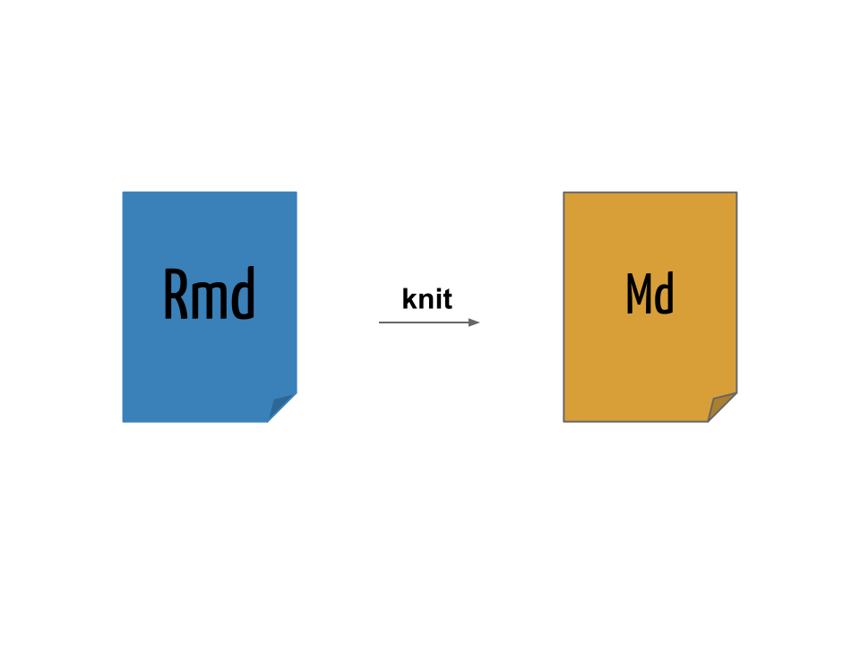

```{r setup, include=FALSE}
source("setup_knitr.R")
```

# O que é Markdown?

> *Markdown is a text-to-HTML conversion tool for web writers. Markdown
> allows you to write using an easy-to-read, easy-to-write plain text
> format, then convert it to structurally valid XHTML (or HTML).*
>
> > John Gruber

* [Markdown][] é uma [linguagem de marcação][] simples para escrever
  textos
* O texto pode ser lido sem nenhum processamento, ou seja, da maneira
  como está escrito
* Outras linguagens de marcação como HTML e $LaTeX$ requerem um grande
  número de *tags* para formatar o texto, muitas vezes dificultando a
  leitura do código-fonte
* A proposta do Markdown é que o escritor se concentre no texto e não na
  formatação
* Pode ser convertido para vários outros formatos além de HTML

## Sintaxe do Markdown

A sintaxe do Markdown é muito simples, e pode ser resumida da seguinte
forma:

### Cabeçalhos

```
# Título
## Sub-título
### Sub-sub-título
```

### Itálico

```
*Este texto aparecerá em itálico.*
```

*Este texto aparecerá em itálico.*

### Negrito

```
**Este texto aparecerá em negrito.**
```

**Este texto aparecerá em negrito.**

### Listas não-ordenadas

```
- Primeiro item
- Segundo item
- Terceiro item
```

- Primeiro item
- Segundo item
- Terceiro item

### Listas ordenadas

```
1. Primeiro item
2. Segundo item
3. Terceiro item
```

1. Primeiro item
2. Segundo item
3. Terceiro item

### Sub-listas

Utilize 4 espaços para criar uma sub-lista:

```
1. Primeiro item
	- Um sub-item
    - Outro sub-item
2. Segundo item
3. Terceiro item
```

1. Primeiro item
    - Um sub-item
    - Outro sub-item
2. Segundo item
3. Terceiro item

### Links

Links para endereços Web podem ser inseridos com `[texto](link)`:

```
O criador do conceito de "literate programming" foi
[Donald Knuth](https://en.wikipedia.org/wiki/Donald_Knuth).
```

O criador do conceito de "literate programming" foi
[Donald Knuth](https://en.wikipedia.org/wiki/Donald_Knuth).

```
Devemos instalar o pacote [knitr](http://yihui.name/knitr) para poder
usar o R Markdown.
```

Devemos instalar o pacote [knitr](http://yihui.name/knitr) para poder
usar o R Markdown.

### Imagens

Para inserir uma imagem, a sintaxe é a mesma de inserir um link, mas com
uma exclamação (`!`) na frente: ``.

O link para a imagem pode ser um enderço Web:

```

```


Ou um endereço local:

```

```


### Parágrafo

Para criar parágrafos basta pular uma linha:

```
O criador do conceito de "literate programming" foi
[Donald Knuth](https://en.wikipedia.org/wiki/Donald_Knuth).

Devemos instalar o pacote [knitr](http://yihui.name/knitr) para poder
usar o R Markdown.
```

O criador do conceito de "literate programming" foi
[Donald Knuth](https://en.wikipedia.org/wiki/Donald_Knuth).

Devemos instalar o pacote [knitr](http://yihui.name/knitr) para poder
usar o R Markdown.

### Códigos

Para apresentar códigos na própria linha, colocamos o texto entre duas
crases (` ` `):

```
Para gerar números aleatórios de uma distribuição normal no R, use a
função `rnorm()`.
```

Para gerar números aleatórios de uma distribuição normal no R, use a
função `rnorm()`.

Para apresentar blocos de código, coloque o texto entre três crases
seguidas (` ``` `) no início e no final:

    ```
	x <- rnorm(n = 10, mean = 100, sd = 5)
	hist(x, main = "")
    ```

```
x <- rnorm(n = 10, mean = 100, sd = 5)
hist(x, main = "")
```

Note que esse código não será interpretado, ele apenas será mostrado no
texto. Esse será o papel do R aqui!

### Tabelas

Tabelas podem ser escritas da seguinte forma:

```
    Caracter | Permissão
    ---------|----------
    `r`      | Permissão de leitura (*read*)
    `w`      | Permissão de escrita (*write*)
    `x`      | Permissão de execução (*execute*)
    `-`      | Permissão desabilitada
```

Para gerar o seguinte resultado:

Caracter | Permissão
---------|----------
`r`      | Permissão de leitura (*read*)
`w`      | Permissão de escrita (*write*)
`x`      | Permissão de execução (*execute*)
`-`      | Permissão desabilitada

### Equações matemáticas

Equações matemáticas podem ser escritas em formato $LaTeX$. A página
HTML resultante irá remderizar as equações através do [MathJax][].

Equações na própria linha podem ser inseridas entre `$`:

```
Um modelo de regressão linear simples:  $Y = \beta_0 + \beta_1 x + \epsilon$.
```

Um modelo de regressão linear simples: $Y = \beta_0 + \beta_1 x +
\epsilon$.

Equações podem ser exibidas entre `$$`:

```
$$
f(x;\mu,\sigma^2) = \frac{1}{\sigma\sqrt{2\pi}}
e^{ -\frac{1}{2}\left(\frac{x-\mu}{\sigma}\right)^2 }
$$
```

$$
f(x;\mu,\sigma^2) = \frac{1}{\sigma\sqrt{2\pi}}
e^{ -\frac{1}{2}\left(\frac{x-\mu}{\sigma}\right)^2 }
$$

## Escrevendo um documento em Markdown

Um documento Markdown possui a extensão `.md` (embora não seja a única
possível).

Veja o arquivo de exemplo [Exemplo1.md](Exemplo1.md).

Para converter um documento Markdown em HTML é necessário um
**conversor**.

O conversor padrão do Markdown é escrito em Perl, e pode ser integrado
em diversas ferramentas, mas não é apropriado para usuários comuns.

Para testar a conversão do documento, copie e cole na página do
[Dingus][].

# Pandoc

O [Pandoc][] é um conversor extremamente versátil, capaz de converter
diversos formatos, incluindo Markdown para HTML.

Se o Pandoc estiver instalado no seu sistema (Linux) é possível
converter o documento com

```{sh, eval=FALSE}
pandoc -f markdown -t html Exemplo1.md -o Exemplo1.html
```

O pacote `knitr` possui a função `pandoc()` que é um *wrapper* para
executar o programa `pandoc` no sistema.

```{r, eval=FALSE}
pandoc(input = "Exemplo1.md", format = "html")
```

Em ambos os casos, o resultado pode ser visualizado ao abrir o arquivo
[Exemplo1.html](Exemplo1.html) no navegador.

## Usando o knitr com Markdown

No exemplo anterior, escrevemos um documento em Markdown (`.md`) e
inserimos códigos do R, que são apenas apresentados no documento final.

Agora vamos usar o knitr a nosso favor, fazedo com que ele interprete e
retorne resultados dos códigos que inserimos.

Para isso renomeie a extensão do arquivo de `.md` para `.Rmd`.

Os blocos de códigos (ou *chunks*) agora devem conter uma marcação
especial para indicar que devem ser interpretados pelo R. Para isso,
colocamos `{r}` no início de cada bloco, que agora ficam

    ```{r}`r ''`
    x <- rnorm(n = 10, mean = 100, sd = 5)
    hist(x, main = "")
    ```

Usando o mesmo exemplo anterior, vamos renomear o arquivo `Exemplo1.md`
para `Exemplo1-knitr.Rmd` e incluir a marção `{r}`.

Também é possível colocar códigos do R para serem renderizados na
própria linha com `` `r '\x60r \x60'` ``, por exemplo, `` `r '\x60r
2+2\x60'` `` gera o resultado `r 2+2` no documento.

Veja o arquivo [Exemplo1-knitr.Rmd](Exemplo1-knitr.Rmd). Agora usamos o
knitr, através da função `knit()` para compilar o documento `.Rmd` em um
documento com sintaxe Markdown `.md`

```{r, eval=FALSE}
knit("Exemplo1-knitr.Rmd")
```
<table>
<tr>
<td align="center"></td>
</tr>
</table>

O resultado da compilação pode ser vista no arquivo
[Exemplo1-knitr.md](Exemplo1-knitr.md).

Agora temos um documento em Markdown com os códigos do R avaliados. Mas
ainda precisamos processar esse arquivo para gerar o arquivo `.html`
através do Pandoc

```{r, eval=FALSE}
pandoc(input = "Exemplo1-knitr.md", format = "html")
```

que gera o arquivo [Exemplo1-knitr.html](Exemplo1-knitr.html) que pode
ser visualizado no navegador.

## Metadados

Uma opção interessante ao utilizar o Pandoc é incluir metados no formato
[YAML][].

Os metadados em YAML são escritos em formato de lista aninhada, e o
Pandoc usa essas informações para incluir, por exemplo, título, autor, e
data em um documento.

A opção mais importante para o `rmarkdown` é o campo `output`, que
permite especificar o formato desejado de saída, o mesmo especificado no
argumento `output_format =` da função `render()`.

Os metadados em YAML são colocados sempre no **início** de um documento,
e são delimitados por `---`. Exemplo típico:

```
---
title: "Meu documento em R Markdown"
author: "Fernando Mayer"
date: 18 de setembro, 2015
output: html_document
---
```

Veja o arquivo [Exemplo1-yaml.Rmd](Exemplo1-yaml.Rmd).

Com isso, não é mais necessário especificar o argumento `output_format
=` na chamada da função `render()`.

Também é possível incluir vários formatos ao mesmo tempo, por exemplo

```
---
title: "Meu documento em R Markdown"
author: "Fernando Mayer"
date: 18 de setembro, 2015
output:
  html_document: default
  pdf_document: default
---
```

E compilar todos eles ao mesmo tempo com

```{r, eval=FALSE}
render("Exemplo1-yaml.Rmd", output_format = "all")
```

Veja [Exemplo1-yaml.html](Exemplo1-yaml.html), e
[Exemplo1-yaml.pdf](Exemplo1-yaml.pdf).


<!-- links -->

[Donald Knuth]: https://en.wikipedia.org/wiki/Donald_Knuth
[MathJax]: http://www.mathjax.org
[Dingus]: http://daringfireball.net/projects/markdown/dingus
[Markdown]: http://daringfireball.net/projects/markdown
[rmarkdown]: http://rmarkdown.rstudio.com
[Friedrich Leisch]: http://www.statistik.lmu.de/~leisch
[Sweave]: https://www.statistik.lmu.de/~leisch/Sweave
[Yihui Xie]: http://yihui.name/
[knitr]: http://yihui.name/knitr
[Pandoc]: http://pandoc.org/
[YAML]: http://yaml.org/
[linguagem de marcação]: https://pt.wikipedia.org/wiki/Linguagem_de_marcação/
